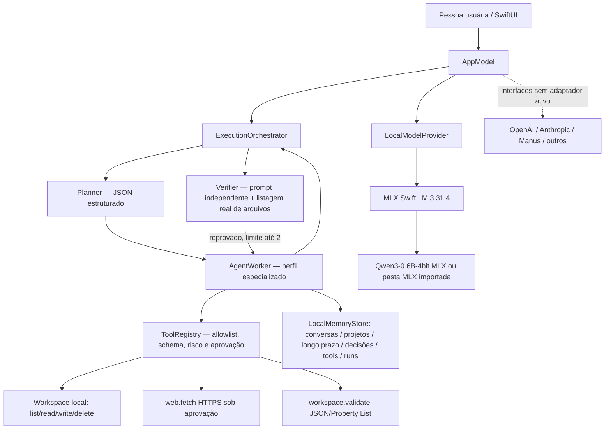

# Arquitetura

## Ciclo de uma execução

1. `AppModel` confere que tools foram instaladas, o objetivo não está vazio e o modelo local está pronto.
2. `ExecutionOrchestrator` grava o objetivo em conversas e chama `Planner` com contexto durável recente.
3. `Planner` valida JSON do `TaskPlan`, valida limite de oito tarefas/duas rodadas de correção e grava plano/premissas.
4. `AgentWorker` executa as tarefas **sequencialmente**. Cada papel tem prompt e allowlist; a allowlist de `ToolRegistry` é verificada novamente no momento da chamada.
5. A resposta estruturada do modelo pode solicitar tools. A aplicação valida formato, IDs, argumentos, schema e permissão; nunca trata texto do modelo como autorização.
6. Escrita, exclusão e GET web vão para `ApprovalCenter`; a tela apresenta o payload real. Se a aprovação for recusada, o handler não é executado.
7. `Verifier` pede uma análise independente do mesmo modelo, com os relatórios e evidência resultante de `workspace.list`. Se apontar correções, o orquestrador chama Programador até o limite e verifica novamente.
8. `RunRecord`, resultados, plano e mensagens locais são gravados em buckets separados.

## Componentes

- **Inferência:** `LocalModelProvider` desacopla executor/planner/verifier do vendor. A implementação desta entrega é `MLXLocalModelProvider`, usa `LLMModelFactory`, `ChatSession`, history rehydration e streaming do MLX Swift LM. Qwen3 usa `/no_think` e geração limitada. Não há fallback de resposta pré-programada.
- **Agentes:** dez papéis e permissões declaradas em `AgentCatalog`. Compartilham um modelo e contexto de inferência, mas não a mesma allowlist.
- **Tools:** `ToolRegistry` guarda definição, JSON schema em string, risco, exigência de aprovação e handler. `workspace.validate` valida JSON/Property List local sem executar código do usuário.
- **Workspace:** `Documents/ArcanjoDev/Workspace`, único local onde as ferramentas podem modificar arquivos. Prévia HTML usa WKWebView, não publica o projeto.
- **Memória:** JSONL em Application Support, com diretórios `conversations`, `projects`, `longTerm`, `decisions`, `toolResults` e `runs`. Sem sincronização de rede.
- **Adaptadores externos:** `IntegrationAdapter` e `ModelProvider` são contratos. Git, GitHub, Netlify, Gmail, WhatsApp Business e Instagram/Meta constam como não implementados; não há endpoints presumidos.

## Escolhas e limitações

- Não há backend auxiliar: inferência MLX roda localmente; somente dependências SwiftPM e primeiro download do modelo requerem rede.
- Não há paralelismo multiagente, execução de shell, compilação de projeto ou test runner genérico dentro do iPhone. As tarefas são sequenciais e os limites de tokens/turnos/ferramentas reduzem ciclos sem fim.
- A verificação é análise por modelo mais inspeção de arquivos; o validador determinístico cobre apenas JSON/Property List. Nenhuma dessas rotinas prova que um site ou app foi compilado/executado.
- Contratos futuros não têm autenticação, credenciais, gestão de tokens nem fluxos OAuth. Secrets não devem ser adicionados até existir um armazenamento Keychain e escopos definidos.

Veja também [`COMPONENT_RESEARCH.md`](docs/COMPONENT_RESEARCH.md) e [`SECURITY.md`](SECURITY.md).
